# Cloud Computing Assignment 2a

### PES1UG20CS084

### Aryansh Bhargavan

---

**Task 1**

>Screenshot of the running Docker Container after installing Jenkins
>
>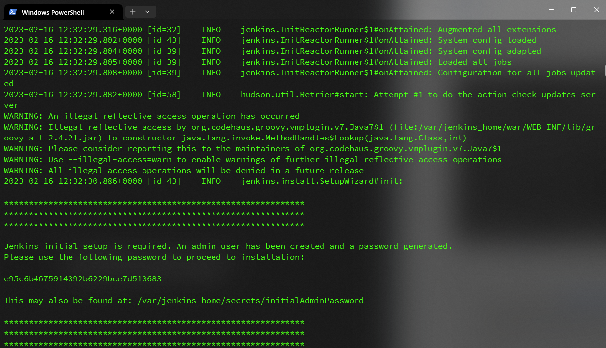

**Task 2**

> Picture showing the console output after the build is successful
>
> 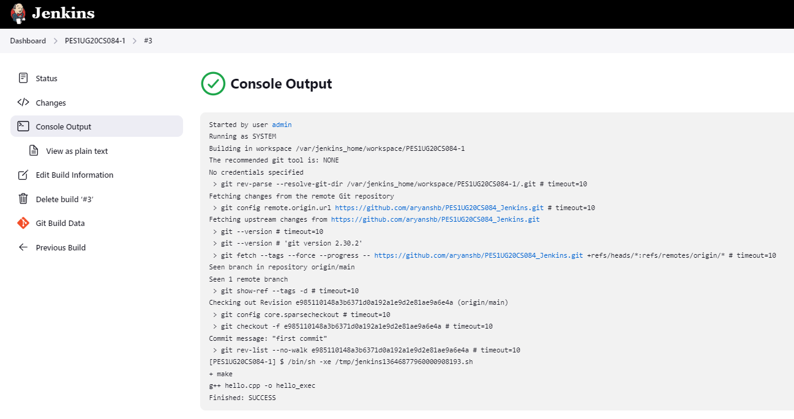
>
> Picture showing the Stable state of the task in Build History of Jenkins
>
> 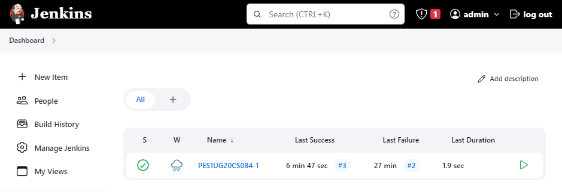

**Task 3**

> Console output of second job
>
> 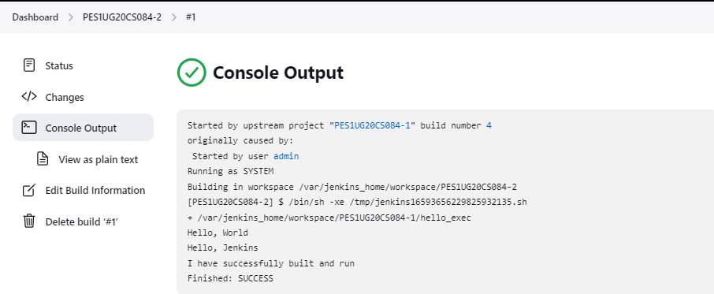
>
> Status page of first job
>
> 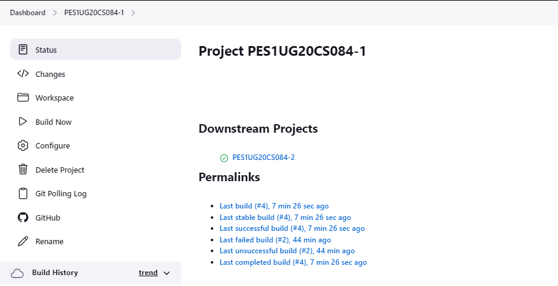
>
> Build History of Jenkins
>
> 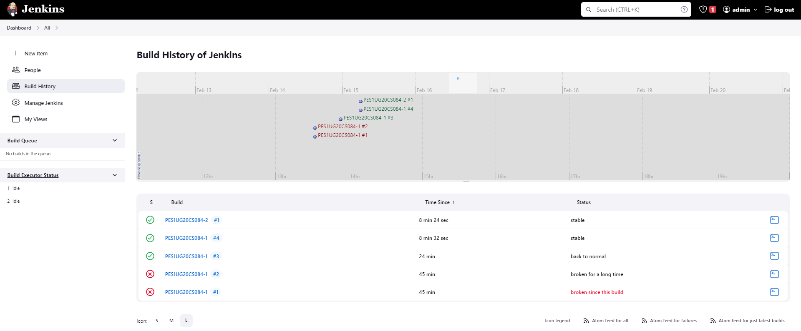
>
> Jenkins Dashboard
>
> 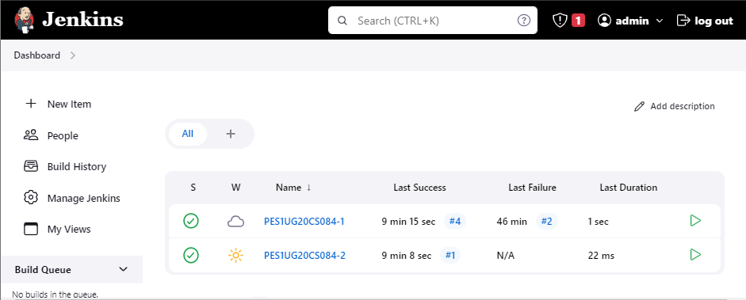

**Task 4**

> Webhook added to your GitHub repository
>
> 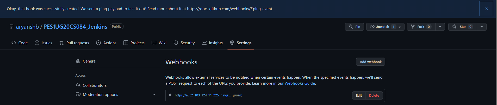
>
> Console Output of second job displaying the change made in hello.cpp file
>
> 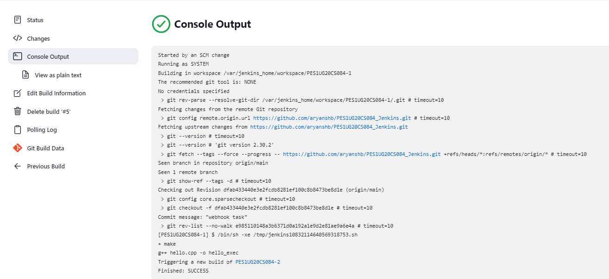

**Task 5**

> Code/script written to create basic pipeline using GitHub repository
>
> ```Jenkinsfile
> pipeline{
>     agent any
>     stages{
>         stage ('Build'){
>             steps{
>                 sh 'make'
>                 echo 'build stage successful'
>                 build job: 'PES1UG20CS084-1'
>             }
>         }
>         stage ('Test'){
>             steps{
>                 sh './hello_exec'
>                 echo 'test stage successful'
>             }
>         }
>         stage ('Deploy'){
>             steps{
>                 echo 'Deployment successful'
>             }
>         }
>     }
>     post{
>         failure{
>             echo 'Pipeline failed'
>         }
>     }
> }
> ```
>
> Output of working created pipeline, the screenshot should include 
>
> ​	● Stage view / Execution status of pipeline with all stages succeeded
>
> ​    ● Verify Declarative: Post Actions stage succeed for handling failures. 
>
> 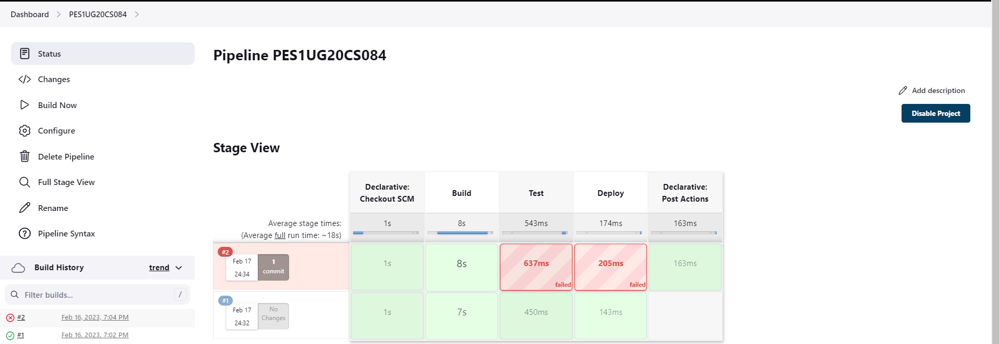
>
> Console Output of the Pipeline
>
> 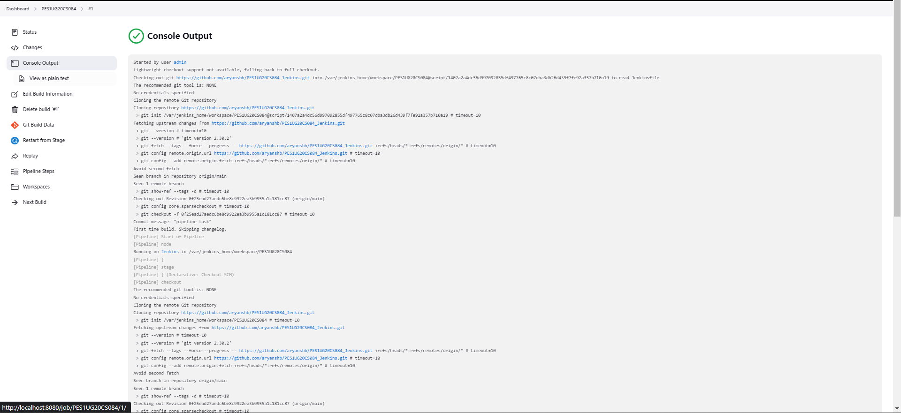
>
> Link to the created GitHub repository
>
> <a href="https://github.com/aryanshb/PES1UG20CS084_Jenkins">aryanshb/PES1UG20CS084_Jenkins</a>
>
> ---


